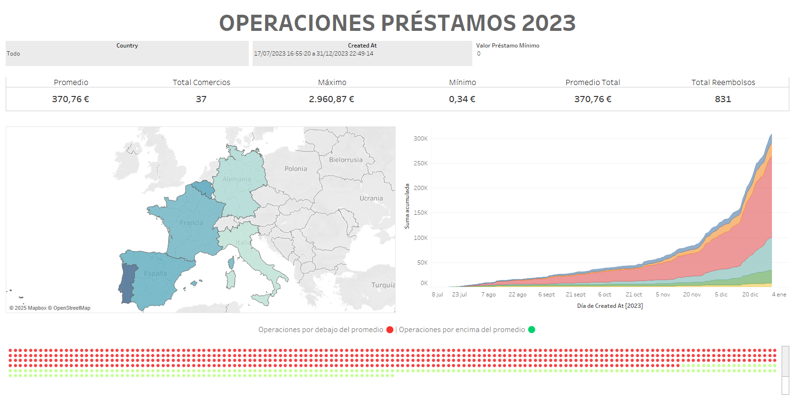

# Business Case: Analyzing Loan Performance for Strategic Decision-Making

# Introduction

A fintech company specializing in providing short-term loans to small and medium-sized enterprises (SMEs) for purchasing products from various merchants. By offering flexible financing options, the company aims to empower businesses with the necessary capital to acquire essential equipment, inventory, and operational tools, facilitating their growth and sustainability.

As the company expands its operations, ensuring the efficiency and profitability of its loan portfolio becomes crucial. Analyzing past transactions, repayment patterns, and risk indicators is vital for refining the company's credit risk models, optimizing loan allocation strategies, and improving overall financial health.

# Business Challenge

During 2023, the company observed fluctuations in loan performance across different regions, merchants, and product categories. The company seeks to answer key questions regarding:

1. The overall performance of its loan portfolio, including average loan sizes, total loan values, and repayment behaviors.

2. Identifying high-risk segments that exhibit frequent refunds or late payments.

3.  geographic trends to optimize expansion strategies.

4. Evaluating merchant partnerships and identifying which businesses contribute most significantly to financial success.

# Visualization
For a interative dashboard experience please refer to this link [here](https://public.tableau.com/app/profile/ra.l.p.rez1875/viz/PerezLopezRal1/Dashboard#1).

# Key Insights

- Spain had the highest transaction volume among all countries, indicating a strong demand for loans in this region.
- Germany had relatively low loan volume throughout 2023, suggesting limited market activity or demand in this country.
- A transaction of €0.34 was recorded, which is likely a test transaction rather than an actual loan.
- Loan volume increased significantly towards the end of the year, suggesting seasonal trends or a higher demand for financing in the final months.
- The total number of reimbursements reached 831, reflecting active loan repayment activity across all regions.

# Conclusion

The data indicates that Spain was the dominant market for loan transactions in 2023, while Germany contributed minimally. The significant rise in loan volume at the end of the year suggests potential seasonal factors influencing borrowing behavior. Further investigation could help understand whether this trend is due to economic conditions, promotions, or other external factors.
